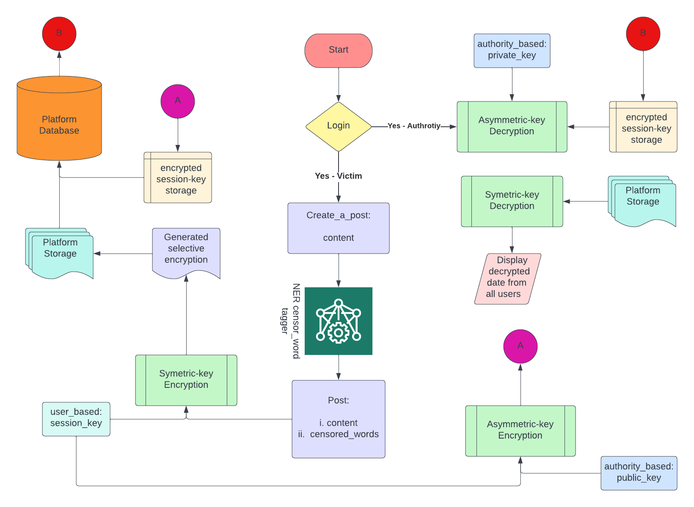

# #maskUp: Selective Attribute Encryption for Sensitive Vocalization for English language on Social Media Platforms

## Our Aim:

We aim to estimate and accurately retrieve sensitive information and provide security for the vocalization of crimes. While previous literature and implementation focus on identification of victim blaming language and overall data encryption, they do not account for the impact these messages may have and the inherent fear amongst victims to come forward. It also does not account how essential it is to communicate said information. 

Therefore, a methodology that only encrypts vital information that may be limited to characteristic names, locations, or other sensitive aspects of the texts is proposed. For this, we offer a streamlined pipeline that augments Named Entity Recognition with Selective Encryption to formalize Selective Attribute Encryption for Sensitive Vocalization on Social Media Platforms. 

**To our knowledge, this is the first work in the field of computational social science that aims to protect the privacy of the victims by masking their confidential details as well as emboldening them to come forward to report crimes.**

## Motivation:

The rise in gender-based crimes has been alarmingly high over the past few years. Reports show that globally, 1 in 3 women experience physical and/or sexual violence in their lifetime (WHO 2021). However, societal and structural barriers like societal stigma and shame, distrust of institutions, fear of retaliation by the perpetrator, misuse of power by concerned authorities and prolonged trials, prevent women from coming forward and reporting crimes. 

**Therefore, a platform to voice opinions without fear of societal judgment, devoid of misuse of power by institutions**, is required to encourage women to speak up. Social media giants like Twitter, Facebook, Instagram, and Reddit have been very instrumental in being such a platform.

However, one must understand that information relayed on topics as volatile as Sexual Harassment and Crimes, a topic that women are most afraid of, can leak sensitive information and cause disastrous outcomes. Victims of sexual assault are often held culpable for the assault and face tremendous backlash and personal attacks. Such bullying only adds to their trauma and has a detrimental effect on the person's mental and psychological being. It also discourages other victims from coming forward. With the rise of such crimes, it is essential to devise a computational framework that can identify and prevent the online victimization of sexual assault survivors who choose to report the crime.


## Our Pipeline: 

Our pipeline:
 
* Extracts sensitive phrases/words from given paragraph/post/tweet (further referred to as a document).
* Enables Continual Learning using $EWC$ paradigm for targeted neuron training.
* Selectively encrypts only those aspects of the document which may be sensitive to the users (such as names, locations, organizations, among others.).
* Provides a mechanism for criminal authorities to decrypt all user data (Master-Key Module).



## Example:


## Cite This Work

```
@misc{https://doi.org/10.48550/arxiv.2211.08653,
  doi = {10.48550/ARXIV.2211.08653},
  url = {https://arxiv.org/abs/2211.08653},
  author = {Vijay, Supriti and Priyanshu, Aman},
  keywords = {Computation and Language (cs.CL), FOS: Computer and information sciences, FOS: Computer and information sciences},
  title = {#maskUp: Selective Attribute Encryption for Sensitive Vocalization for English language on Social Media Platforms},
  publisher = {arXiv},
  year = {2022},
  copyright = {Creative Commons Attribution 4.0 International}
}


``` 
